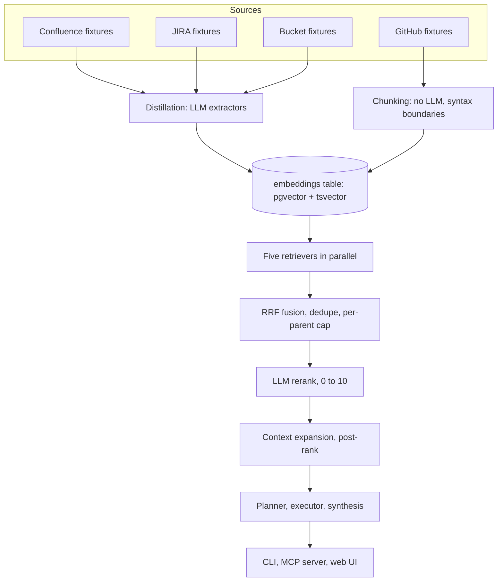

# Anatomy of a Knowledge Base

An open-source, runnable teaching implementation of the architecture in Cerebras's ["How We Built Our Knowledge Base"](https://www.cerebras.ai/blog/how-we-built-our-knowledge-base). **Not affiliated with Cerebras; inspired by their write-up.** Everything here is real and runnable against a fictional company, Helios: real Postgres, real pgvector, real local embeddings, real Cerebras calls if you bring a key, and a fixture corpus (Confluence, JIRA, GitHub, a bucket of docs) sized to actually demonstrate cross-source retrieval instead of just describing it.



Four sources feed one Postgres table. Confluence and JIRA and the bucket go through LLM distillation so a noisy transcript becomes a searchable artifact; GitHub goes through a syntax-aware chunker instead, no LLM required. Every query then runs five retrievers in parallel, fuses them with reciprocal rank fusion, optionally reranks the survivors with an LLM, and only expands context for candidates that made the final cut. `packages/core` implements all of it once; the CLI, MCP server, and web UI are thin clients over the same functions, not three separate reimplementations.

## Quickstart

```bash
podman compose up -d      # or docker compose up -d, starts Postgres and pgvector
pnpm install
cp .env.example .env      # add a Cerebras key (free tier: cloud.cerebras.ai), or skip for retrieval-only
pnpm kb init
pnpm kb ingest            # 5 to 45 min with a key, tier-dependent; ~3 min raw-text mode without one
pnpm kb search "why does checkpoint restore stall?" --project helios-eng --explain
```

That last command returns real ranked evidence in seconds, with or without a key. With one, `--explain` also shows LLM rerank scores.

## Three surfaces, one library

**CLI** (`packages/cli`): `kb search --explain`, `kb get`, `kb ask --trace`, `kb who-knows`. Real, trimmed:

```
1. HEL-482: Checkpoint restore stalls after manifest load on 128-shard clusters (jira://HEL-482)
2. HEL-482 comment by Priya Natarajan (jira://HEL-482)
3. Runbook: NFS Mount Troubleshooting / Symptoms of a bad mount (confluence://HELIOS/HEL-008)
```

**MCP server**: Claude Code discovers it from the committed [`.mcp.json`](.mcp.json) the moment it opens the repo; any other MCP client adds it with `claude mcp add kb -- pnpm --dir /path/to/repo kb-mcp` or its equivalent. Eight LLM-free tools (`search`, `get_document`, `search_confluence`, `search_jira`, `search_code`, `who_knows`, `list_projects`, `status`) that any MCP client orchestrates itself, with input schemas generated from the parameters each tool actually reads. `search` returns ranked guesses; `get_document` dereferences any result's `url` into the full artifact, the whole JIRA thread, every section of a page, an entire source file. JIRA rows also carry `links`: file paths distillation extracted from the thread, existence-checked, ready to hand back to `get_document` for a code-grounded hop. The full operating pattern an agent should run is [`docs/11-agent-playbook.md`](docs/11-agent-playbook.md). Real `search_code({ query: "HELIOS_PREFETCH_DEPTH" })` result:

```
src/checkpoint/loader.ts:19   /** Warm the shard cache ahead of restore. Prefetch depth is read from
src/config/env.ts:16          /** HELIOS_PREFETCH_DEPTH controls how many shards the checkpoint loader
```

**Web UI**: `pnpm web`, then open `localhost:8787`. One page, SSE-streamed. Real event from `/api/ask`:

```
event: answer
data: {"stage":"answer","text":"Checkpoints are retained for 14 days, as a decision in May 2026
reduced the retention from the previously documented 30 days [4][5][6]..."}
```

Full tour, with a worked MCP transcript and the SSE-to-UI mapping: [`docs/07-surfaces.md`](docs/07-surfaces.md).

## Eval

`pnpm eval` grades fourteen golden questions against retrieval alone (no LLM); `pnpm eval --live` adds Cerebras rerank. Two are questions the corpus deliberately cannot answer: raw fusion always fills its row budget, so only a scoring layer can say "nothing relevant here", and the abstention questions hold rerank to exactly that. Two more are hop trajectories graded on terminal evidence: search must surface the incident ticket, the ticket's distilled `links` must dereference through `get_document`, and the landing file must contain the flag or error the question is really about. Real scorecards from this store:

```
golden eval, retrieval only: 10/12 passed, 2 skipped, MRR 0.48
golden eval, live rerank:    14/14 passed, MRR 0.69
```

Retrieval-only misses `restore-stall` (the code chunk lands just outside the fused top 10) and `paraphrase-serving` (no shared vocabulary with the fixture), and skips the abstention pair it cannot grade; live rerank recovered both misses on this run and scored every row of both unanswerable questions at or below 3 of 10. The MRR number is the early-warning trend: an expected hit sliding from rank 2 to rank 9 moves it long before a miss flips a PASS to FAIL. Rerank is an LLM call and the corpus comes from LLM distillation, so neither number is fixed: re-ingesting the same fixtures reorders results, and this scorecard has moved between 8 and 10 of 10 across runs, which is exactly why the eval exists instead of a one-off spot check. See [`docs/05-fusion-rerank.md`](docs/05-fusion-rerank.md) for a reproducible worked example of rerank demoting a code chunk on this same question.

## Models

| Stage | Model | Env override | Why |
|---|---|---|---|
| Distillation | `gpt-oss-120b` | `KB_MODEL_DISTILL` | strongest structured extraction, runs once per document |
| Planner | `gemma-4-31b` | `KB_MODEL_PLANNER` | tool selection is a cheap classification pass |
| Rerank | `gemma-4-31b` | `KB_MODEL_RERANK` | fastest model fits a batched 0-to-10 scoring call |
| Synthesis | `zai-glm-4.7` | `KB_MODEL_SYNTHESIS` | the user-facing cited answer deserves the strongest writer |

Embeddings are local and free: `Xenova/bge-small-en-v1.5` via `@huggingface/transformers`, 384 dimensions, no key required for ingestion or retrieval-only search.

## Docs

| Page | What it teaches |
|---|---|
| [00-overview](docs/00-overview.md) | the vertical stack and reading order |
| [01-schema](docs/01-schema.md) | one table, why it wins, the metadata field inventory |
| [02-ingestion](docs/02-ingestion.md) | the connector contract, idempotency, three layers of fault isolation |
| [03-distillation](docs/03-distillation.md) | embed the artifact not the transcript, a real thread walked end to end |
| [04-retrieval](docs/04-retrieval.md) | five retrievers, two measured surprises about IDF and full-text |
| [05-fusion-rerank](docs/05-fusion-rerank.md) | RRF with real fixture numbers, rerank's honest miss |
| [06-answer](docs/06-answer.md) | planner, executor, synthesis, and a real trust-boundary callout |
| [07-surfaces](docs/07-surfaces.md) | CLI, MCP, web UI, and what degrades without a key |
| [08-scaling](docs/08-scaling.md) | every demo simplification, named, next to its production fix |
| [09-write-your-own-connector](docs/09-write-your-own-connector.md) | a fifth source, in under 60 lines |
| [10-first-two-hours](docs/10-first-two-hours.md) | the onboarding path: run it, read one search, then design |
| [11-agent-playbook](docs/11-agent-playbook.md) | the operating pattern for AI agents: signals, hops, abstention |

## What this is not

No authentication, no authorization, no audit trail. No live connectors: every source is a fixture reader over static files, not a Confluence, JIRA, GitHub, or S3 API integration. No tombstones, no partitioning, no read replicas. This is a teaching implementation of the collection and query pillars, deliberately, with every simplification named instead of hidden: see [`docs/08-scaling.md`](docs/08-scaling.md) for the full list and what each one costs at real scale.

## License

MIT. See [`LICENSE`](LICENSE).
