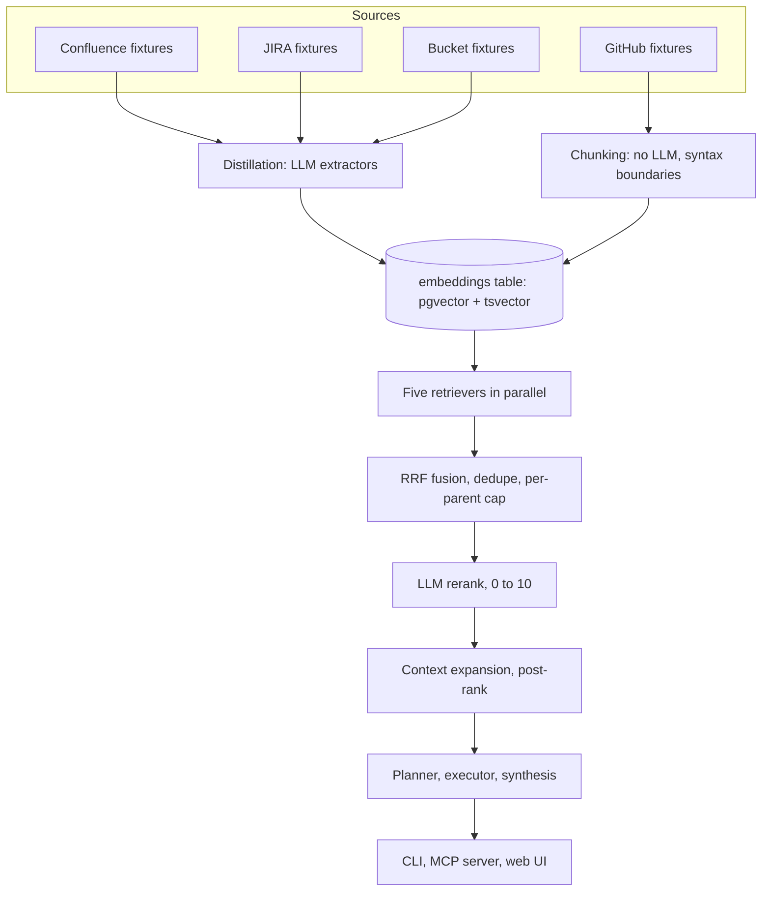

# 00. Overview

This repo is a runnable teaching implementation of the architecture described in Cerebras's ["How We Built Our Knowledge Base"](https://www.cerebras.ai/blog/how-we-built-our-knowledge-base). It is not affiliated with Cerebras; it is inspired by their write-up and rebuilt from scratch against a fictional company, Helios, so every claim in these docs can be pointed at a real file and a real query result instead of a diagram.

Helios makes a model-serving platform. Its knowledge lives in four places: a Confluence-shaped wiki (`fixtures/confluence`), a JIRA-shaped issue tracker with comment threads (`fixtures/jira`), a small real TypeScript codebase (`fixtures/github/helios`), and a bucket of markdown documents (`fixtures/bucket`). All four are fixture files, not live connectors: the point of this repo is to teach the pipeline, not to run production integrations. See `docs/09-write-your-own-connector.md` for how a fifth, real source would plug in.

## The vertical stack

Every stage in that diagram is a numbered doc: ingestion and distillation build the embeddings table (`docs/02`, `docs/03`), retrieval and fusion turn a query into ranked evidence (`docs/04`, `docs/05`), and the answer layer turns evidence into a cited response (`docs/06`). The three surfaces (`docs/07`) are thin clients over the same `packages/core` library; none of them re-implement the pipeline.

## Three pillars, two implemented

The source write-up frames a knowledge base as three pillars: **collect** the data, **query** it well, and **govern** who can see what. This repo builds the first two in full and treats the third as a documented design discussion rather than shipped code. Collection is `packages/core/src/ingest`: connectors, distillation, chunking, idempotent upserts. Querying is `packages/core/src/retrieval` and `packages/core/src/answer`: five retrievers, reciprocal rank fusion, an LLM reranker, and a planner/executor/synthesis loop. Governance, meaning per-source access control mapped at query time and an audit trail, is out of scope; `docs/08-scaling.md` names exactly what a real deployment would need to add and why it is not a small addition.

## Source mapping

The fixture corpus mirrors the blog's source list so the retrieval story stays honest across systems that actually reference each other (a JIRA incident cites a Confluence runbook which cites a file path that exists in the code fixture).

| This repo | Blog's source | Fixture directory | Connector |
|---|---|---|---|
| Confluence | Wiki | `fixtures/confluence` | `packages/core/src/ingest/connectors/confluence.ts` |
| JIRA | Incidents, plus Slack-thread lessons | `fixtures/jira` | `packages/core/src/ingest/connectors/jira.ts` |
| GitHub | Code | `fixtures/github/helios` | `packages/core/src/ingest/connectors/github.ts` |
| Bucket | Custom object storage | `fixtures/bucket` | `packages/core/src/ingest/connectors/bucket.ts` |

There is no Slack connector; JIRA's comment threads carry that lesson instead. A thread is a sequence of comments, and consecutive same-author runs ("bursts") get evaluated for their own embedding independent of the parent issue, which is exactly the problem of extracting a decision from a chat thread. `docs/03-distillation.md` walks a real thread through that logic end to end.

## Reading order

The docs are numbered in pipeline order, and reading order is file order: `00-overview` (this page) sets the map, `01-schema` through `04-retrieval` cover collection and search, `05-fusion-rerank` through `07-surfaces` cover ranking and the answer layer, `08-scaling` plus `09-write-your-own-connector` cover what changes at production scale, and `10-first-two-hours` plus `11-agent-playbook` close with the two onboarding paths: one for a human running it, one for an AI agent driving it. Each page links directly to the source files it explains; nothing here is described without a path you can open.

Start with the schema (`docs/01-schema.md`) if you think in data models, or `docs/02-ingestion.md` if you think in pipelines. Both eventually meet at the same table.
