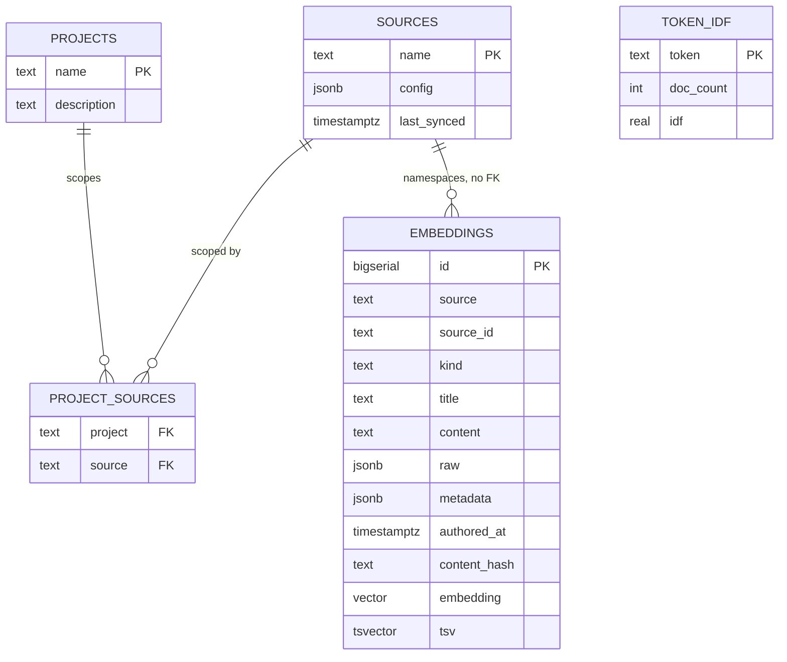

# 01. Schema

One table carries the corpus. Four small tables carry scoping and statistics around it. The whole schema is one migration: [`packages/core/src/schema/migrations/001_init.sql`](../packages/core/src/schema/migrations/001_init.sql), with the row shape mirrored in [`packages/core/src/schema/types.ts`](../packages/core/src/schema/types.ts).

## Why one table wins

Every retriever in `packages/core/src/retrieval` queries `embeddings` directly: full-text against `tsv`, vector against `embedding`, rare-token against `content`, recency against `authored_at`. A per-source table layout would mean every retriever either unions N tables or every query pays a branch on source type. One table means one query surface, and it means exactly one HNSW index (`embeddings_hnsw`) does approximate nearest-neighbor search across the entire corpus instead of four smaller indexes that each need their own tuning and each miss cross-source matches by construction.

The tradeoff is that connectors know nothing about each other and don't need to. Each of the four in `packages/core/src/ingest/connectors` implements `discover()` and `distill()` against the shared `EmbeddingInsert` shape and upserts into the same table on `(source, source_id)`. Adding a fifth source (`docs/09-write-your-own-connector.md`) never touches the schema. The `sources` table is a lightweight registry: a name, a config blob, and a `last_synced` watermark, not a foreign key parent of `embeddings`. That's deliberate: `embeddings.source` is a plain text tag, not an enforced relationship, so a connector can start writing rows before its source is registered and nothing in the schema stops a typo from creating a new de facto source. `docs/02-ingestion.md` covers what does catch that.

## Metadata: recorded versus consumed

`metadata` is a JSONB grab-bag because the four sources don't share a shape. Not everything written there is read back. This is the honest inventory, not the aspirational one:

| Field | Written by | Consumed by |
|---|---|---|
| `url` | all four connectors | `retrieval/search.ts`, `answer/tools.ts` build every citation URL from this |
| `authors` | confluence, jira, bucket | `answer/tools.ts` `who_knows` sums authorship weight per person |
| `path` | github | `retrieval/expand.ts` reads the source file back for code context expansion |
| `distilled` | all four | `ingest/run.ts` counts degraded rows at ingest time only, never read at query time |
| `boundary`, `labels`, `sectionIndex`, `sectionCount` | github / confluence / bucket | nothing today; recorded for a future filter or debug view that doesn't exist yet |
| `status`, `type`, `components`, `systems`, `code_refs` | jira | the facts are folded into `content` during distillation so they influence ranking as text; `code_refs` additionally becomes the `links` field on evidence rows, each path existence-checked at retrieval time so an agent can hop straight to the file with `get_document` |

Section neighbor expansion is the clearest case of a field that looks load-bearing and isn't: `sectionIndex` and `sectionCount` are written on every Confluence and bucket section, but `retrieval/expand.ts`'s `neighborSections` reconstructs the index by splitting `source_id` on `#` instead of reading the metadata field that already has it. Both would work; only one is wired up. That kind of drift is normal in a JSONB column with no schema enforcement, and it's a reason to think twice before treating an unindexed metadata field as a contract.

## The generated column

`tsv` is `GENERATED ALWAYS AS (to_tsvector('english', coalesce(title,'') || ' ' || content)) STORED`. Postgres recomputes it on every insert or update to `title` or `content` and persists the result, so the GIN index (`embeddings_tsv`) stays correct without the application ever writing to the column or remembering to re-index. The cost is paid once per write, not once per query, which is the right tradeoff for a corpus that's read far more than it's written. It also means full-text search can never drift from the row it indexes, unlike an external search index that has to be kept in sync by hand.
