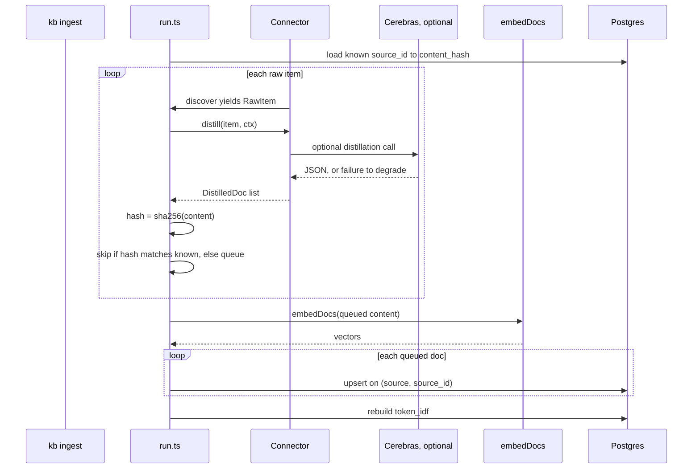

# 02. Ingestion

Every source implements the same two-method contract from [`packages/core/src/schema/types.ts`](../packages/core/src/schema/types.ts):

```ts
interface Connector {
  source: string;
  discover(): AsyncIterable<RawItem>;
  distill(item: RawItem, ctx: DistillCtx): Promise<DistilledDoc[]>;
}
```

`discover()` walks a fixture directory and yields raw items; `distill()` turns one raw item into zero or more rows ready to embed. The four implementations are [`connectors/confluence.ts`](../packages/core/src/ingest/connectors/confluence.ts), [`connectors/jira.ts`](../packages/core/src/ingest/connectors/jira.ts), [`connectors/github.ts`](../packages/core/src/ingest/connectors/github.ts), and [`connectors/bucket.ts`](../packages/core/src/ingest/connectors/bucket.ts). The orchestrator that drives all four is [`ingest/run.ts`](../packages/core/src/ingest/run.ts).



## Idempotency

`content_hash` is `sha256` of the **distilled** content, computed after `distill()` returns, not a hash of the raw fixture file. `run.ts` loads a `source_id → content_hash` map before touching a source and skips any item whose new hash matches the stored one. This has a real consequence: because distillation calls an LLM, two ingests of an unchanged fixture are not guaranteed to distill to byte-identical text, so a re-ingest can re-embed rows that didn't actually change on disk. The corpus is small enough that this costs seconds, not minutes; at production scale it's a reason to hash the raw input too and only re-distill when that changes.

## Fault isolation

Three independent try/catch boundaries in `run.ts`, deliberately layered so one bad unit never takes down a whole ingest:

- **Per-item**: the `distill()` call for a single item is wrapped individually. A thrown error there increments `stat.failed` and logs `item ${sourceId} failed`, then the `discover()` loop moves to the next item.
- **Per-source**: the outer `for await` over `discover()` and the embedding step are each wrapped again, so a source whose fixture directory is missing, or whose embedding call throws entirely, marks that source failed and the next connector still runs.
- **Per-row**: the upsert loop wraps each `INSERT ... ON CONFLICT` individually, so one constraint violation doesn't roll back every row queued in the same batch.

Ingest ends with a summary per source: `ingested`, `skipped`, `degraded`, `failed`, plus a total `token_idf` rebuild count and elapsed time, printed by `packages/cli/src/index.ts`. `degraded` and `failed` are different signals: degraded rows landed with `metadata.distilled = false` (the LLM extraction failed or was skipped, so raw text got embedded instead); failed rows didn't land at all.

## The test-database guard

Early in this project, a test run's `beforeAll` truncated `embeddings` against whatever `DATABASE_URL` happened to be set to. Once, that was the live `kb` database instead of `kb_test`, and the test suite's fixture seed silently replaced real, already-distilled content with a fresh copy of the same fixtures. A row-count check would not have caught this: the live store and a freshly seeded test store have the same source IDs and roughly the same row count, so "did the count stay the same" passes either way. Only the content, and the fact that it was regenerated rather than distilled through the real pipeline, differed.

The fix is `assertTestDatabase()` in [`packages/core/test/helpers.ts`](../packages/core/test/helpers.ts): it checks that `DATABASE_URL` ends in `_test` and throws otherwise. It runs first inside `ensureCorpus()` and again in the `beforeAll` hooks of `ingest.test.ts` and `schema.test.ts`, so any test invocation that isn't pointed at `kb_test` fails loudly before it truncates anything, no matter how the tests were launched.
