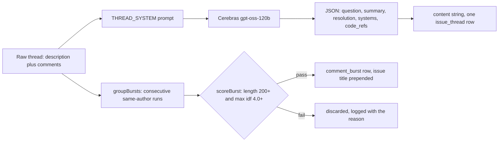

# 03. Distillation

The rule for every source that gets an LLM pass is: embed the artifact, not the transcript. A JIRA thread is noisy: a description, a reproduction comment, a joke, a root-cause comment, a confirmation. Nobody searching the knowledge base wants a transcript; they want "what was wrong and how was it fixed." Distillation is the step that produces that artifact, in [`packages/core/src/ingest/distill.ts`](../packages/core/src/ingest/distill.ts) for Confluence and bucket sections, and inline in [`packages/core/src/ingest/connectors/jira.ts`](../packages/core/src/ingest/connectors/jira.ts) for issue threads.



## Worked example: HEL-482

The fixture [`fixtures/jira/HEL-482.json`](../fixtures/jira/HEL-482.json) is an incident: checkpoint restore hangs on 128-shard clusters after the manifest loads. Its thread has a reporter, a repro comment, an off-topic joke, a root-cause comment, and a confirmation. `THREAD_SYSTEM` asks the model for exactly this JSON shape, and here is what the live store actually holds for this issue, reconstructed field by field from `content`:

```json
{
  "question": "checkpoint restore hangs on 128-shard clusters after manifest load",
  "summary": "Restoring a training checkpoint with 128 shards stalls indefinitely after the manifest loads because the default prefetch depth of 16 overloads the NFS mount. Reducing the prefetch depth resolves the issue.",
  "resolution": "Set the environment variable HELIOS_PREFETCH_DEPTH=4 (or lower) before running the restore; the checkpoint completes successfully.",
  "systems": ["checkpoint loader", "NFS storage", "training cluster"],
  "code_refs": ["src/checkpoint/loader.ts", "HELIOS_PREFETCH_DEPTH"]
}
```

`jira.ts` joins `[issue.summary, question, summary, resolution, ...systems, ...code_refs]` into one `content` string and embeds it as a single `issue_thread` row. That row is what every retriever sees: dense, on-topic, and carrying the exact flag name and file path a search for this incident needs, none of which required a human to write a runbook. The `code_refs` do double duty: at retrieval time, every ref that names a real file surfaces as a `links` entry on the evidence row, so the pointer the model extracted becomes a hop an agent can follow with `get_document` (the pattern [11-agent-playbook](11-agent-playbook.md) builds on).

## What bursting keeps

The four comments on HEL-482 are each a different author, so `groupBursts` treats each as its own single-comment burst and `scoreBurst` grades it against two thresholds: total text length of at least 200 characters, and a maximum per-token IDF of at least 4.0. Three of the four fail:

- Owen Reyes: "Reproduced on staging with 128 shards...", 89 characters, fails length.
- Sam Whitfield: "my laptop also hangs when it sees monday", 41 characters, fails length, and it is a joke with no signal to score anyway.
- Maya Okafor: "Confirmed fixed with depth 4. Updating the runbook.", 52 characters, fails length.

Priya Natarajan's comment passes both: it's over 400 characters and contains `HELIOS_PREFETCH_DEPTH`, a token whose IDF clears 4.0 easily. It becomes its own `comment_burst` row with the issue title prepended, so it's retrievable even independent of the distilled issue_thread row, and citable as the specific comment that names the fix. The three filtered comments are logged with their reason and never embedded; they add nothing a search would want and would only dilute the index.

## The degradation contract

If `ctx.llm` is absent, or the LLM call throws, or the reply isn't valid JSON after one repair attempt, distillation does not fail the row. `distillSection` and the JIRA distiller both fall back to embedding the raw text and set `metadata.distilled = false`. This is a hard contract: **a degraded row still lands**. Comment bursts are always raw text by design (never LLM-distilled individually) and code chunks never call an LLM at all, so `run.ts` doesn't count either as "degraded," reserving that count for JIRA and Confluence and bucket rows that were supposed to be distilled and weren't.

## Surprise: rate limiting degrades quality, not availability

The first live ingest against a free-tier Cerebras key degraded 138 of 188 rows. Not because the API was down, but because 429 responses were treated as ordinary failures: the client exhausted its retry budget on rows that would have succeeded with a few seconds' patience. The fix, in [`packages/core/src/models/cerebras.ts`](../packages/core/src/models/cerebras.ts), is to read the `Retry-After` header off a 429 and sleep exactly that long before the next attempt, combined with a flat 400ms pace between calls in `packages/cli/src/index.ts` so free-tier throughput never gets ahead of the limit in the first place. Rate limiting is not a binary up-or-down failure mode; ignoring `Retry-After` turns a temporary slowdown into permanent data loss, since a degraded row doesn't get a second chance until the next full re-ingest.
