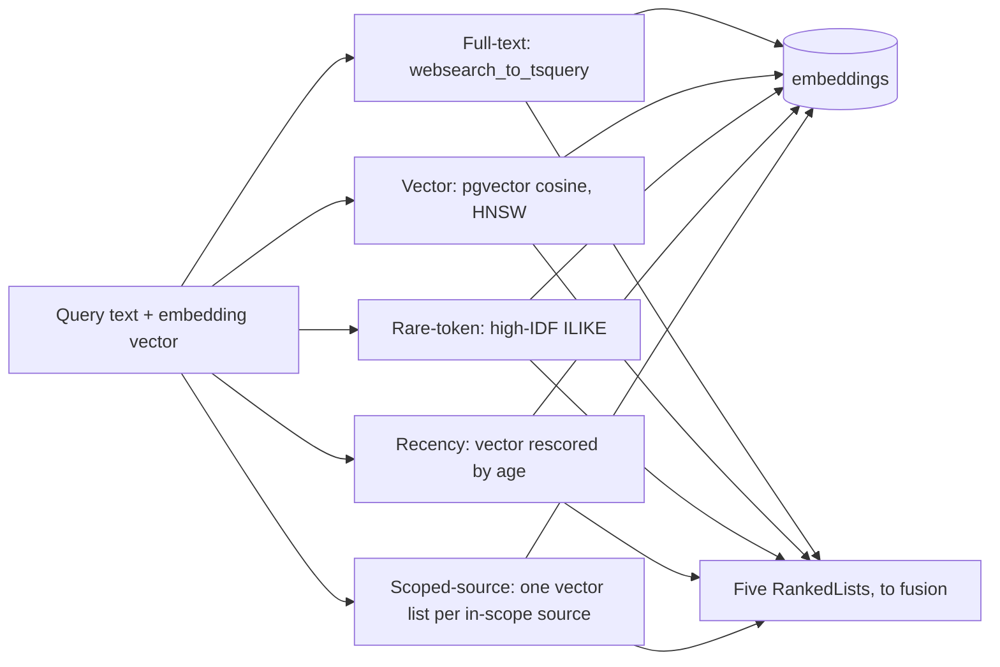

# 04. Retrieval

Every query runs five retrievers in parallel, each producing an independently ranked list over the same `embeddings` table. None of them is trusted alone; `docs/05-fusion-rerank.md` covers how the lists get reconciled. This page is about what each list is good at and, more usefully, what it silently cannot do. The implementations are [`retrieval/retrievers.ts`](../packages/core/src/retrieval/retrievers.ts) (full-text, vector) and [`retrieval/signals.ts`](../packages/core/src/retrieval/signals.ts) (rare-token, recency); the orchestration is [`retrieval/search.ts`](../packages/core/src/retrieval/search.ts).

## Blind spots

| Retriever | Catches | Misses | Covered by |
|---|---|---|---|
| Full-text | exact tokens, error codes, flag names, fast | AND semantics: one missing stem empties the list; no paraphrase | Vector |
| Vector | paraphrase, no shared vocabulary needed | exact tokens and rare identifiers get diluted into a 384-dim average | Full-text, rare-token |
| Rare-token | high-signal technical terms via IDF-weighted substring match | zero query tokens clear the IDF floor, or terms are rare, but ambiguous | Full-text, vector |
| Recency-weighted vector | breaks ties on genuinely stale-vs-current answers | inherits vector's blind spot; source-specific half-life must be tuned per corpus | Full-text, rare-token |
| Scoped-source vector | guarantees every in-scope source contributes at least one candidate | doesn't rank across sources; a low-signal in-scope hit still gets a seat | RRF fusion reconciles by summing contributions |

## Surprise: IDF inverts in a technical corpus

The rare-token retriever's floor is `minIdf = 2.5`. Two real numbers from `token_idf` on the live store: `helios`, the company name, appears in 60 of 237 documents and scores **1.37**; `helios_prefetch_depth`, a genuinely rare and load-bearing flag, appears in 14 documents and scores **2.829**. Verify both yourself: `SELECT token, doc_count, idf FROM token_idf WHERE token IN ('helios','helios_prefetch_depth');`. So far, intuitive: rare flag outscores common noun.

The unintuitive part is why the floor sits at 2.5 and not higher. During corpus calibration, casual chatter tokens like `thanks` and `sounds` measured **3.52** and **5.47** respectively, both clearing 2.5 and both outscoring the technical flag. In a technical corpus, specialized vocabulary repeats: a dozen tickets about the same subsystem all use the same flag name, so it isn't actually rare by document count. A one-off aside like "sounds good" appears in exactly one comment out of hundreds and IDF cannot tell that apart from a rare, important term; both are statistically unusual. You won't find `thanks` in today's `token_idf` table, because the burst filter (`docs/03-distillation.md`) already discards short one-line asides before they're ever embedded, but that's a property of distillation, not of this threshold. Raise the floor to exclude chatter and it excludes load-bearing terms below it too. The 2.5 floor exists only to skip terms so common they'd surface half the corpus; chatter suppression is fusion and rerank's job, because only they see the whole ranked list against the actual question.

## Surprise: AND semantics leave real gaps

`websearch_to_tsquery` ANDs its stemmed terms. The golden question *"The model server refuses to boot after I changed its settings"* becomes `'model' & 'server' & 'refus' & 'boot' & 'chang' & 'set'` and returns **zero rows** against the live corpus, even though `HEL-007` documents exactly this failure using none of that vocabulary ("config validation aborts startup"). Confirm it: `SELECT count(*) FROM embeddings, websearch_to_tsquery('english', '<question>') q WHERE tsv @@ q;` returns `0`. Full-text isn't broken; AND semantics are doing exactly what they promise, and the promise doesn't cover paraphrase.

The same brittleness shows up more quietly on `"restore hangs after manifest load"` scoped to `helios-eng`: full-text returns exactly **one** row, the single ticket using all four stems, where vector, rare-token, and each scoped source list return five apiece. Vector and the scoped lists are what actually surface the Confluence runbooks and the code chunk that make the question answerable. This is the concrete argument for running five retrievers instead of tuning one: no single retriever's failure mode is quiet, but fusion never sees only one list's opinion.

## Recency and half-life

`recencyRetriever` takes the top 100 vector results and rescores each by `score * exp(-ageDays * ln2 / halfLifeDays)`, an exponential decay tuned per source in `HALF_LIFE_DAYS`:

| Source | Half-life (days) | Why |
|---|---|---|
| `jira` | 90 | incidents and decisions age out fast; a year-old ticket is rarely still the current answer |
| `confluence` | 180 | runbooks update but survive longer than a single incident |
| `bucket` | 365 | posts and drafts are dated but not operationally stale |
| `github` | 3650 | code doesn't decay just because a file wasn't touched recently |

## Scoping and the unknown-project guard

Inside a project, `search.ts` adds one extra vector list per in-scope source (`${source}-vector`, limit 10), so a source that would be crowded out globally still gets a guaranteed seat before fusion. `projectSources()` resolves a project name to its source list; if the name doesn't exist, it resolves to `[]`. Passed straight through, `source = ANY('{}')` matches nothing, and a project typo would silently return zero results rather than fail. `search()` checks for that case explicitly and throws `unknown project "<name>" (no sources configured)` instead, because "no results" and "invalid scope" need to look different to whoever's debugging.
