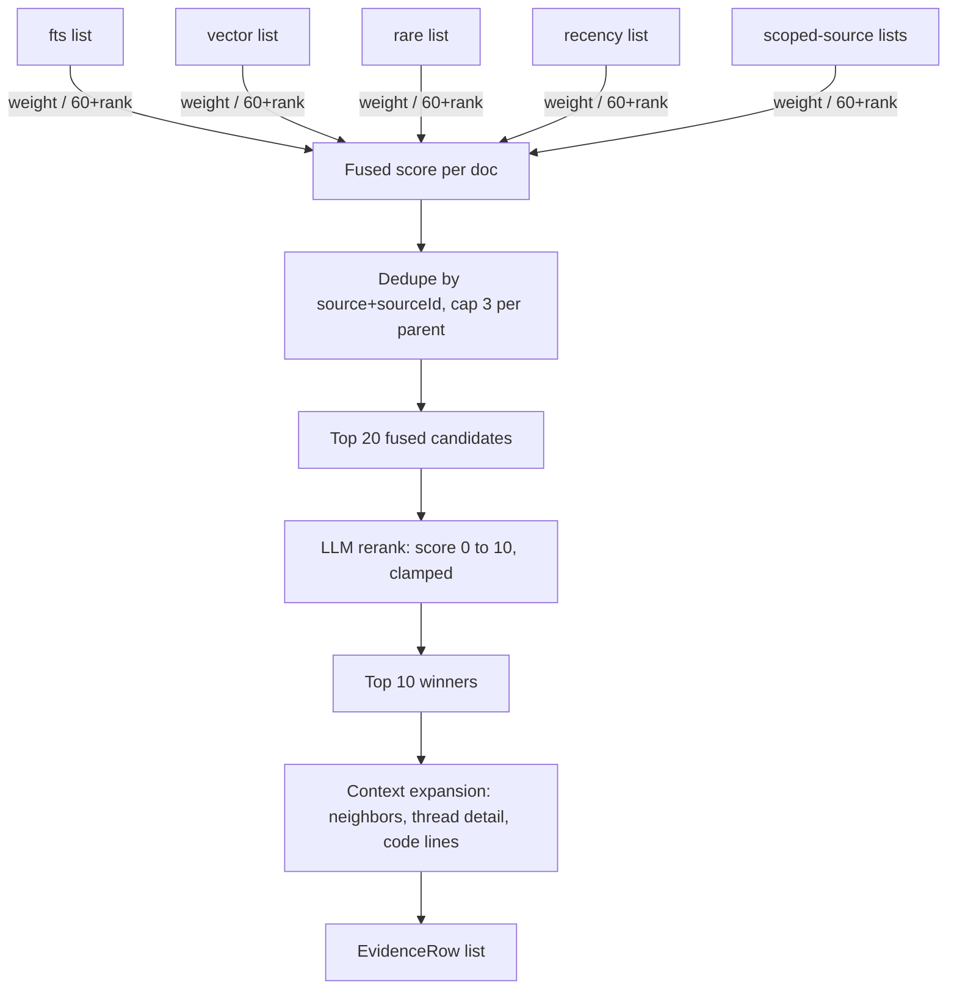

# 05. Fusion and Rerank

Five ranked lists become one evidence set in three steps: fuse by reciprocal rank, rerank with an LLM, then expand only the winners. The implementation is [`retrieval/rrf.ts`](../packages/core/src/retrieval/rrf.ts) (fusion), [`retrieval/rerank.ts`](../packages/core/src/retrieval/rerank.ts) (rerank), and [`retrieval/expand.ts`](../packages/core/src/retrieval/expand.ts) (expansion), orchestrated in [`retrieval/search.ts`](../packages/core/src/retrieval/search.ts).



## RRF, with real numbers

`fuse()` scores every document by summing `weight / (K + rank)` across every list it appears in, `K = 60`. This is the actual fusion table for `pnpm kb search "restore hangs after manifest load" --project helios-eng --explain` against the live store, trimmed to the top 8:

```
HEL-482                            0.0753  = fts#1:0.0164 + vector#5:0.0154 + rare#1:0.0164 + recency#33:0.0108 + jira-vector#1:0.0164
src/restore/coordinator.ts#1-51    0.0618  = vector#8:0.0147 + rare#10:0.0143 + recency#1:0.0164 + github-vector#1:0.0164
HEL-001#0                          0.0608  = vector#3:0.0159 + rare#13:0.0137 + recency#5:0.0154 + confluence-vector#3:0.0159
HEL-019#2                          0.0530  = vector#15:0.0133 + rare#15:0.0133 + recency#26:0.0116 + confluence-vector#8:0.0147
HEL-482#b2                         0.0525  = vector#20:0.0125 + rare#9:0.0145 + recency#37:0.0103 + jira-vector#6:0.0152
src/restore/fetcher.ts#1-62        0.0465  = vector#10:0.0143 + recency#2:0.0161 + github-vector#2:0.0161
HEL-001#1                          0.0464  = vector#4:0.0156 + recency#6:0.0152 + confluence-vector#4:0.0156
HEL-019#1                          0.0454  = vector#1:0.0164 + recency#19:0.0127 + confluence-vector#1:0.0164
```

## Why consensus beats a single vote

Look at the arithmetic, not just the ranking. A document that finishes rank 1 in exactly one list contributes `1/(60+1) = 0.0164`, the single biggest contribution any one list can give. `HEL-482` wins with `0.0753`, more than four such finishes stacked, not because it dominates one list but because it shows up in five: first in `fts`, `rare`, and `jira-vector`, fifth in `vector`, thirty-third in `recency`. That's the point of RRF: a document many signals agree on beats a document one signal loves and the rest ignore. `src/restore/coordinator.ts` earns rank 2 the same way, present across `vector`, `rare`, `recency`, and its own scoped `github-vector` list, never higher than 8th in any single one.

## Dedupe and per-parent caps

Before scoring, `fuse()` keys every document on `source:sourceId`, so a document returned by three lists contributes three summed terms to one entry, not three separate rows. After scoring, `parentKey()` strips the `#section` suffix (`confluence:HEL-001` covers `HEL-001#0` through `HEL-001#4`) and caps each parent at 3 winners by default. Without the cap, a single long runbook or thread with many strong sections could fill most of the top 10 with itself; the cap trades a little per-document recall for guaranteed diversity across documents, which matters more when the answer might live in a different source entirely.

## Rerank: a batched 0 to 10 call, clamped

The fused top 20 go to the reranker in one call: each candidate gets an index, a truncated 300-character preview, and one instruction to score 0 to 10 against the question. `rerank()` clamps every returned score with `Math.max(0, Math.min(10, score))` before use, because nothing stops a model from returning an out-of-range or malformed number, and drops any index that doesn't map to a real candidate. If the reply doesn't parse as the expected array, rerank returns `null` and `search()` falls back to fused order, labeled as skipped rather than silently wrong.

A real, measured consequence: rerank can demote code chunks for definitional or narrative questions. Above, `src/restore/coordinator.ts` and `src/restore/fetcher.ts` ranked 2nd and 6th in fusion, ahead of several surviving Confluence sections. After rerank, neither appears in the top 10: the model scored `HEL-482`, its resolving comment, and the two Confluence runbook sections all at 9 or 10, pushing both code chunks below the cutoff. This is honest, not broken: the ticket and runbook answer "why does restore stall" directly; the code is the mechanism, not the explanation.

This demotion isn't guaranteed every run: rerank is an LLM call, and the corpus under it comes from nondeterministic LLM distillation, so the golden eval's own phrasing of this question currently passes live even though the query above reproduces the demotion on demand. Re-ingesting the same fixtures reshuffles rankings, so the live scorecard moves between 8 and 10 of 10 across runs, which is exactly why an eval exists instead of a spot check.

## Expansion happens after ranking

`expandDoc()` only runs on the final winners, after rerank has discarded 10 of the fused 20. Expansion is not cheap: it fetches neighboring Confluence or bucket sections, the longest and most recent JIRA comments, or ten extra lines of surrounding code, sometimes multiplying a candidate's size several times over. Running it before ranking would pay that cost for candidates thrown away half the time; running it after means every expanded token is attached to a document that already earned its place.
