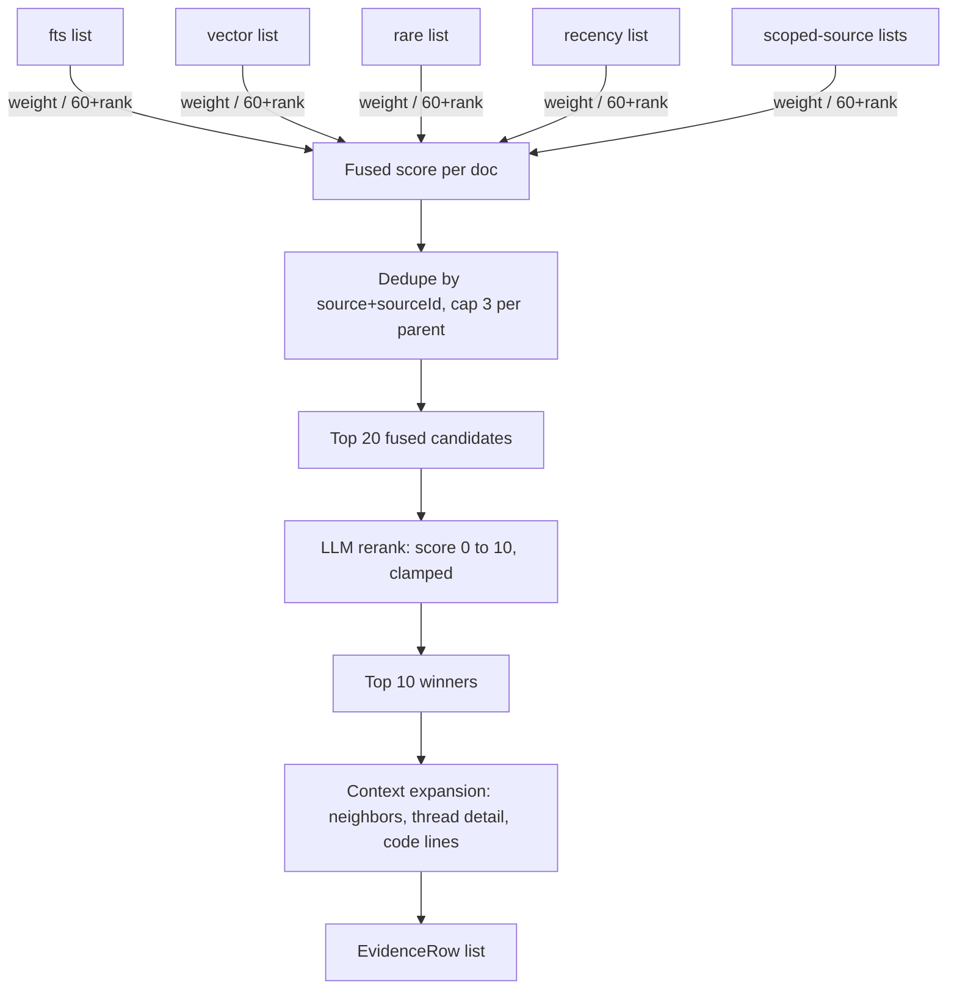

# 05. Fusion and Rerank

Five ranked lists become one evidence set in three steps: fuse by reciprocal rank, rerank the fused candidates with an LLM, then expand only the winners. The implementation is [`retrieval/rrf.ts`](../packages/core/src/retrieval/rrf.ts) (fusion), [`retrieval/rerank.ts`](../packages/core/src/retrieval/rerank.ts) (rerank), and [`retrieval/expand.ts`](../packages/core/src/retrieval/expand.ts) (expansion), orchestrated in [`retrieval/search.ts`](../packages/core/src/retrieval/search.ts).



## RRF, with real numbers

`fuse()` scores every document by summing `weight / (K + rank)` across every list it appears in, `K = 60`. This is the actual fusion table for `pnpm kb search "restore hangs after manifest load" --project helios-eng --explain` against the live store, trimmed to the top 8:

```
HEL-482                            0.0753  = fts#1:0.0164 + vector#5:0.0154 + rare#1:0.0164 + recency#33:0.0108 + jira-vector#1:0.0164
src/restore/coordinator.ts#1-51    0.0618  = vector#8:0.0147 + rare#10:0.0143 + recency#1:0.0164 + github-vector#1:0.0164
HEL-001#0                          0.0608  = vector#3:0.0159 + rare#13:0.0137 + recency#5:0.0154 + confluence-vector#3:0.0159
HEL-019#2                          0.0530  = vector#15:0.0133 + rare#15:0.0133 + recency#26:0.0116 + confluence-vector#8:0.0147
HEL-482#b2                         0.0525  = vector#20:0.0125 + rare#9:0.0145 + recency#37:0.0103 + jira-vector#6:0.0152
src/restore/fetcher.ts#1-62        0.0465  = vector#10:0.0143 + recency#2:0.0161 + github-vector#2:0.0161
HEL-001#1                          0.0464  = vector#4:0.0156 + recency#6:0.0152 + confluence-vector#4:0.0156
HEL-019#1                          0.0454  = vector#1:0.0164 + recency#19:0.0127 + confluence-vector#1:0.0164
```

## Why consensus beats a single vote

Look at the arithmetic, not just the ranking. A document that finishes rank 1 in exactly one list contributes `1/(60+1) = 0.0164` and nothing else; that's the single biggest possible contribution any one list can give. `HEL-482` wins with `0.0753` not because it dominates any one list, but because it shows up in five: first in `fts`, first in `rare`, first in `jira-vector`, fifth in `vector`, and a distant thirty-third in `recency`. Its total is more than four single-list first-place finishes stacked, which is the point of RRF: a document that many independent signals agree on beats a document that one signal loves and the rest ignore. `src/restore/coordinator.ts` earns its rank 2 the same way, appearing across `vector`, `rare`, `recency`, and its own scoped `github-vector` list, never finishing higher than 8th in any single one.

## Dedupe and per-parent caps

Before scoring, `fuse()` keys every document on `source:sourceId`, so a document returned by three different lists contributes three summed terms to one entry, not three separate rows. After scoring, `parentKey()` strips the `#section` suffix (`confluence:HEL-001` covers `HEL-001#0` through `HEL-001#4`) and caps each parent at 3 winners by default. Without the cap, a single long Confluence runbook or JIRA thread with many strong sections could fill most of the top 10 with itself; the cap trades a small amount of per-document recall for guaranteed diversity across documents, which matters more when the answer might live in a different source entirely.

## Rerank: a batched 0 to 10 call, clamped

The fused top 20 go to the reranker in one call: each candidate gets an index, a truncated 300-character preview, and a single instruction to score 0 to 10 against the question. `rerank()` clamps every returned score with `Math.max(0, Math.min(10, score))` before use, because nothing stops a model from returning an out-of-range or malformed number, and drops any index that doesn't map to a real candidate. If the reply doesn't parse as the expected array at all, rerank returns `null` and `search()` falls back to fused order, labeled as skipped rather than silently wrong.

A real, measured consequence: rerank can demote code chunks for questions that read as definitional or narrative. In the run above, `src/restore/coordinator.ts` and `src/restore/fetcher.ts` ranked 2nd and 6th in fusion, ahead of several Confluence sections that survived. After rerank, neither appears in the top 10 at all; the reranker scored `HEL-482`, its resolving comment, and the two Confluence runbook sections all at 9 or 10, and pushed the code chunks below the visible cutoff. The live golden eval scores this exact behavior: `9/10`, with the one miss being this same question, missing `github:src/checkpoint/loader.ts` from the top 10. This is honest behavior, not a bug: for "why does restore stall," the incident ticket and the runbook answer the question directly, while the code is the mechanism, not the explanation. A reranker asked to judge relevance to the literal question will do exactly that, and a demo that hid this miss would be lying about what LLM rerank actually does to an evidence set.

## Expansion happens after ranking

`expandDoc()` only ever runs on the final winners, after rerank has already discarded 10 of the fused 20. Expansion is not cheap: it fetches neighboring Confluence or bucket sections, the longest and most recent JIRA comments, or ten extra lines of surrounding code, sometimes multiplying a candidate's size several times over. Running it before ranking would mean paying that cost for candidates that get thrown away half the time; running it after means every expanded token is attached to a document that already earned its place in the answer.
