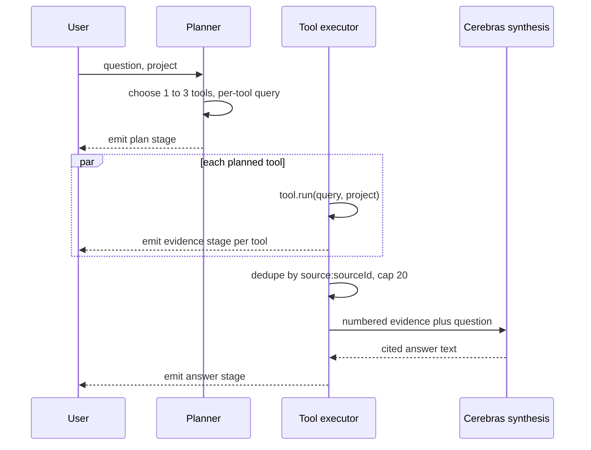

# 06. Answer

Search returns evidence. `ask` turns evidence into a cited answer, in three stages: a planner picks tools, an executor fans them out, and a synthesis call writes the answer against numbered evidence. The implementation is [`answer/planner.ts`](../packages/core/src/answer/planner.ts), [`answer/tools.ts`](../packages/core/src/answer/tools.ts), and [`answer/ask.ts`](../packages/core/src/answer/ask.ts).

## The planner catalog and its fallback ladder

`plan()` gets the question, a catalog line per tool (`search`, `search_confluence`, `search_jira`, `search_code`, `who_knows`, `list_projects`, each with its own one-line description), and a catalog of projects, and asks the model to pick 1 to 3 tools with a per-tool query rewrite. Three unrelated failure modes all converge on the exact same fallback: `{ tools: [{ name: "search", query: question }], reasoning: "fallback: plain search", fallback: true }`.

1. The LLM call itself throws (network error, rate limit exhausted).
2. The reply isn't valid JSON, so `JSON.parse` throws.
3. The reply parses fine but names only unknown tools, so the filtered list is empty.

All three are caught by the same try/catch and the same explicit empty-list check, and both paths return the identical fallback object. A planner failure never blocks an answer; it just downgrades to the one tool that works for almost any question. The system prompt also states this directly: "questions about policy, retention, ownership, or anything that could span systems always include the plain search tool," so even a successful plan usually keeps `search` in the mix rather than betting everything on a narrower tool.

## Evidence numbering and dedupe

Tools run in parallel via `Promise.all`; each tool's rows stream to the UI the moment that tool settles, not in planned order. Once every tool has settled, the combined evidence is deduped by `source:sourceId`, keeping the first occurrence, and capped at 20 rows. The dedupe runs after the per-tool stream events, not before: the UI shows every tool's raw results including overlaps, useful for seeing that `search` and `search_confluence` agreed, while synthesis gets one clean, numbered list with no duplicate citations. Numbering happens last, as `<evidence n="1" source="..." url="...">`, so citation numbers always line up with the deduped list, not the raw per-tool lists.

## The conflict caveat, for real

[`eval/golden.json`](../eval/golden.json)'s `retention-conflict` question is designed to make Confluence and JIRA disagree: a wiki page says 30 days, a newer JIRA decision says 14. The synthesis system prompt instructs: "When evidence items disagree, say so explicitly and prefer the newer one, citing both." Here is the actual live answer to `"How long do we retain checkpoints?"` scoped to `helios-eng`, unedited:

> We retain checkpoints for 14 days. While documentation previously specified a 30-day retention period [1][2], a newer decision cut the retention to 14 days effective immediately to reduce storage costs [4][5]. This policy is active in the sweep job and supersedes the older wiki page [4][5].

`[1][2]` cite the Confluence policy page; `[4][5]` cite the JIRA decision thread. The model didn't just pick the newer number, it named the conflict and cited both sources so the reader can see the disagreement was real, not synthesized.

## Trust boundary: evidence is not escaped

Evidence content is interpolated straight into the synthesis prompt: `` `<evidence n="${i+1}" source="${e.source}" url="${e.url}">\n${e.content.slice(0, 1500)}\n</evidence>` ``. Nothing escapes `e.content`, `e.url`, or `e.source` before they land inside that XML-shaped wrapper. For this repo, that's fine: every fixture is authored content the team controls, and there's no path from an untrusted actor into the corpus. It stops being fine the moment a real deployment ingests content nobody reviewed, a public wiki page, a customer-submitted ticket, a scraped web page, because any of those could contain text shaped like `</evidence><system>` and attempt to steer the synthesis call from inside what's supposed to be inert evidence. A production version of this pipeline needs to either escape the reserved characters in evidence content and metadata before interpolation, or move to a message format that structurally separates evidence from instructions instead of concatenating them into one string.
