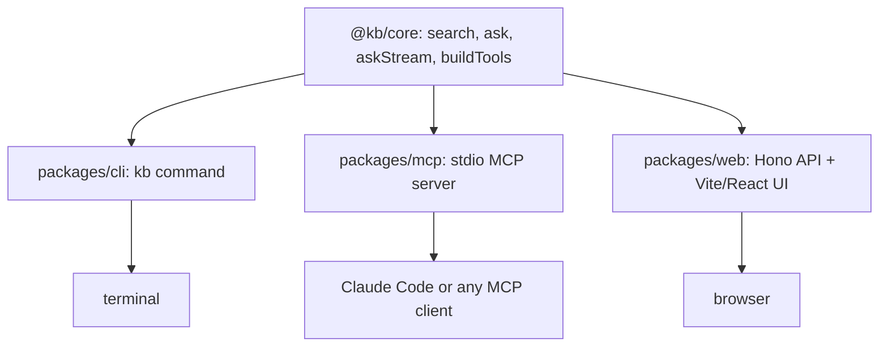

# 07. Surfaces

Three front doors, one library. `packages/cli`, `packages/mcp`, and `packages/web` each call the same `search`, `getDocument`, `ask`, `askStream`, and `buildTools` exports from `@kb/core`; none of them re-implement retrieval or synthesis.



## CLI tour

`kb search --explain` prints every retriever's top results, the RRF contribution table, and rerank scores. Trimmed, real output for `pnpm kb search "why does checkpoint restore stall?" --project helios-eng --explain`:

```
[fts]
  1. HEL-001#0                                0.8383
  2. HEL-482                                  0.8274

[rerank] applied
  HEL-482                                  10/10
  HEL-482#b2                               10/10
  HEL-008#1                                7/10

results
1. HEL-482: Checkpoint restore stalls after manifest load on 128-shard clusters (jira://HEL-482)
2. HEL-482 comment by Priya Natarajan (jira://HEL-482)
3. Runbook: NFS Mount Troubleshooting / Symptoms of a bad mount (confluence://HELIOS/HEL-008)
```

`kb ask --trace` prints the planner's choice, the evidence table, then the streamed cited answer. Real output for `pnpm kb ask "How long do we retain checkpoints?" --project helios-eng --trace`:

```
[planner] Retention policies are typically documented in policy pages or runbooks, and a general search is best for cross-system policy discovery.
  search("checkpoint retention policy")

answer
We retain checkpoints for 14 days. While documentation previously specified a 30-day
retention period [1][2], a newer decision cut the retention to 14 days effective
immediately to reduce storage costs [4][5]. This policy is active in the sweep job
and supersedes the older wiki page [4][5].
```

`kb who-knows` needs no LLM at all. Real output for `pnpm kb who-knows "shard cache"`:

```
Priya Natarajan      Priya Natarajan (17 docs)
Maya Okafor          Maya Okafor (6 docs)
Sam Whitfield        Sam Whitfield (4 docs)
```

`kb get` dereferences any result url (or a bare id) into the complete artifact: `pnpm kb get jira://HEL-482` prints the whole thread, header to last comment, not the longest-plus-last excerpt that context expansion picks for search results.

`search`, `get`, and `ask` all take `--json` for machine callers: the same evidence, trace, and plan objects the web API serves, printed to stdout with warnings routed to stderr. An agent shelling out to the CLI parses structure instead of scraping formatting.

## MCP: raw retrieval, no synthesis

Claude Code discovers the server from the committed [`.mcp.json`](../.mcp.json) when it opens the repo; approve the prompt on first use. Any other MCP client adds it manually:

```
claude mcp add kb -- pnpm --dir /path/to/repo kb-mcp
```

`createKbServer()` in [`packages/mcp/src/server.ts`](../packages/mcp/src/server.ts) registers exactly eight tools, each returning JSON `EvidenceRow[]` as text content: `search`, `get_document`, `search_confluence`, `search_jira`, `search_code`, `who_knows`, `list_projects`, `status`. Every tool is built by `buildTools(pool, { fixturesDir })` with no `llm` option, so `search` runs fusion but never reranks: the MCP client is the orchestrator, this server only serves evidence. `status` closes the loop that orchestration needs: per-source counts and distilled fractions, so an agent can tell "not ingested yet" from "no relevant evidence" without a human checking the database. Ranked rows also surface `links`, the file paths distillation extracted from a thread, existence-checked so each one is safe to hand straight back to `get_document`.

Two contracts make the surface trustworthy for an agent. First, each input schema is generated from the parameters the tool's code actually reads (the `params` list in [`packages/core/src/answer/tools.ts`](../packages/core/src/answer/tools.ts)), so nothing is advertised and ignored: `list_projects` takes no arguments, only `search` takes `project`, and the `project` description is filled from the live projects table at connect time. Second, search and get are deliberately different primitives. Search is uncertain and ranked; `get_document` is a keyed lookup that turns any result's `url` (`jira://HEL-482`, `confluence://HELIOS/HEL-008`, `bucket://file.md`, `github://helios/src/path.ts`) into the full document, deterministically. An agent that re-searches to follow a citation is gambling on retrieval twice; an agent that calls `get_document` is not.

A worked, real example: an agent asked about `HELIOS_PREFETCH_DEPTH` calls `search` first, gets JIRA and Confluence evidence back, notices the flag is defined in code, then calls `search_code` with the same query to ground the answer in the actual source. The real MCP response for `search_code({ query: "HELIOS_PREFETCH_DEPTH" })` includes:

```
src/checkpoint/loader.ts:19   /** Warm the shard cache ahead of restore. Prefetch depth is read from
src/cli/main.ts:18            if (flags.prefetchDepth) { process.env.HELIOS_PREFETCH_DEPTH = String(...
src/config/env.ts:16          /** HELIOS_PREFETCH_DEPTH controls how many shards the checkpoint loader
```

The agent now has the ticket that names the fix, the runbook that documents it, and the three exact lines of code that define and consume the flag, chained from two narrow tool calls it chose itself. If the ticket deserves a full read, `get_document({ uri: "jira://HEL-482" })` returns the entire thread in one call.

## Web UI: SSE stages

`/api/ask` streams `askStream`'s emitted stages directly over server-sent events: `plan`, one `evidence` event per tool as each settles, `answer`, then `done` (or `error`). `packages/web/src/App.tsx` listens for each event name and appends a stage card: `PlanCard` for the tool selection and reasoning, `EvidenceCard` per tool with expandable rows, `AnswerCard` with clickable `[n]` citations that scroll to and flash the matching evidence row. The UI never buffers the whole answer before showing anything; the same event stream that drives the terminal's `--trace` output drives the browser.

## Degradation without a key

Every surface answers the question "what still works with no `CEREBRAS_API_KEY`" differently, and each answer is deliberate:

| Surface | No key | With key |
|---|---|---|
| CLI `kb search` | full pipeline through fusion, rerank skipped and labeled | fusion plus rerank |
| CLI `kb ask` | refuses: "kb ask needs CEREBRAS_API_KEY (retrieval-only mode: use kb search)" | full planner, executor, synthesis |
| CLI `kb who-knows` | always works, no LLM in this tool ever | unchanged |
| MCP server | all eight tools always LLM-free, by design | unchanged, MCP never calls Cerebras |
| Web `/api/search` | fusion order, rerank skipped | reranked |
| Web `/api/ask` | HTTP 503, "ask needs it" | streamed plan, evidence, answer |
| Web `/api/projects` | always works | unchanged |

`who_knows` and `list_projects` never touch an LLM regardless of surface, because ranking people by authorship weight and listing a config table are not synthesis problems.
