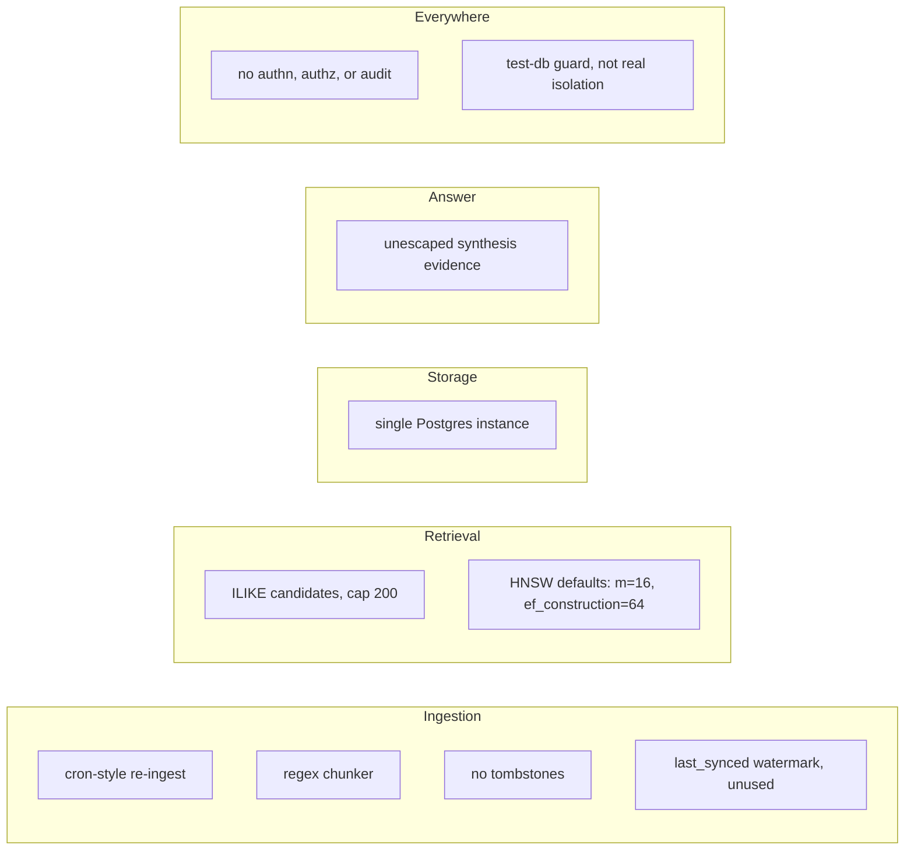

# 08. Scaling

This repo is a demo, not a production system, and every simplification that makes it a good demo is a real thing to unwind before it runs on real data. This page names each one, out loud, rather than letting a reader discover it the hard way.

| Demo simplification | Production reality | Why it matters at scale |
|---|---|---|
| `kb ingest` runs on demand or on a cron | Socket Mode or webhook-driven push per the blog | staleness bounded by the cron interval, not by event latency; a full `discover()` scan of a real source is wasteful when only a handful of items changed |
| Regex-based chunker, `ingest/chunk.ts` | tree-sitter or CocoIndex, a real parser | a parser understands syntax; a regex over lines can misread strings, comments, and type annotations as structure (three concrete quirks below) |
| Rare-token retriever: `content ILIKE ANY(patterns) LIMIT 200` | a proper inverted index (the GIN index already covers exact tokens; a dedicated rare-term index would too) | ILIKE with a leading wildcard can't use a b-tree and degrades toward a sequential scan; the 200-row cap can silently drop real matches once a rare token appears in more than 200 documents |
| No tombstones: a deleted fixture just stops being yielded by `discover()` | sync state tracking that marks and removes rows no longer present upstream | a document deleted at the source stays searchable and citable forever; nothing in this repo ever removes a row from `embeddings` |
| Single Postgres instance for ingest writes and every query-time read | partitioning by source or time, plus read replicas | write and read load share one instance and one HNSW index; at real data volume, index maintenance and query latency both suffer under combined load |
| No authentication, authorization, or audit trail | per-source ACL mapping enforced at query time, the blog's third pillar | anyone who can reach the CLI, MCP server, or web UI sees everything in scope; a real deployment must intersect each result with what the querying user is independently entitled to see in the source system, and log who asked what |
| `assertTestDatabase()`: a suffix check on `DATABASE_URL` | real environment isolation: separate credentials, separate infrastructure, network segmentation | the guard stops one specific accident (tests pointed at the live database); it is not a substitute for environments that cannot reach each other by construction |
| HNSW built with pgvector defaults (`m=16`, `ef_construction=64`) | tuned `m`, `ef_construction`, and query-time `ef_search` against measured recall and latency targets | defaults are a reasonable starting point at any size, but they trade recall, build time, and memory in ways that only show up under real data volume and real query load |
| `sources.last_synced` is written after every ingest, never read | real connector APIs that request deltas since the watermark | every ingest here re-discovers and re-distills the entire fixture set, short-circuited only by a per-row content hash; a real API integration at scale cannot afford to re-list millions of objects on every run |
| Evidence content interpolated into the synthesis prompt unescaped | escaping or structurally fencing evidence before it reaches the model | covered in full in `docs/06-answer.md`; safe only because every fixture is trusted, first-party content |
| `/api/ask` does not cancel in-flight LLM calls when the client disconnects | `AbortSignal` propagated end to end, from the client's disconnect through the request handler into every LLM call | a demo-scale abandoned request wastes one call; at real traffic, abandoned requests that keep running burn LLM spend and hold connections for no reader |

## The three chunker quirks

`chunkTypeScript` finds class and function boundaries with regular expressions and a brace counter, not a parser, and that produces three specific, verified failure modes:

**Sibling fusing.** When a section's matched spans, plus the code between them, total less than `maxChars` (2000 by default), `chunkSpan` collapses everything back into a single chunk instead of keeping the spans separate. Two small, unrelated top-level functions in the same file become one chunk: verified directly, `chunkTypeScript` on two 3-line sibling functions returns exactly one chunk, not two.

**Brace counting in strings.** The boundary scanner counts every `{` and `}` character on every line inside a candidate span, with no awareness of whether that character is inside a string literal or a comment. A function containing the string `"start marker: {"` has an unmatched open brace that the counter never sees close, so the scanner keeps extending the span past the function's real end. Verified directly: a function with that string followed by a second, unrelated function gets merged into one chunk spanning both, mislabeled as a single function boundary.

**Typed arrow consts.** The function regex matches `const NAME = (` directly, `const\s+\w+\s*=\s*(async\s*)?\(`. A type-annotated arrow function, `const readInt: (key: string) => number = (key) => {`, has a `:` between the name and the `=`, which the pattern doesn't allow for, so it never matches as a function boundary and falls through to plain block chunking instead, losing the semantic boundary entirely.

None of these three matter at this corpus's size; a human would notice a merged chunk in code review of the demo. At real scale, across thousands of files nobody reads chunk-by-chunk, they degrade retrieval quietly: a merged chunk buries a small function's signal inside its neighbor's, and a missed function boundary means that function is only ever findable as an arbitrary 60-line block. A real parser doesn't have an opinion about what's inside a string.
