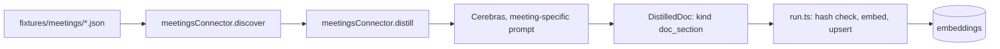

# 09. Write Your Own Connector

Every source in this repo is a fixture reader, and every one of them implements the same two-method contract from [`packages/core/src/schema/types.ts`](../packages/core/src/schema/types.ts). This page builds a fifth source, `meetings`, against that contract. The code below compiles in your head against the real interfaces used by the other four connectors; it isn't wired into the repo, and that's the point: adding a source is small enough to fit on one page.



## The fixture shape

A meeting export is one JSON file per meeting: `{ id, title, date, attendees, transcript }`. Same layout as every other fixture source: a directory of self-contained JSON files, one object per item.

## The connector, in full

```ts
// packages/core/src/ingest/connectors/meetings.ts
import { readdirSync, readFileSync } from "node:fs";
import { join } from "node:path";
import type { Connector, DistilledDoc, RawItem } from "../../schema/types.js";

interface Meeting {
  id: string;
  title: string;
  date: string;
  attendees: string[];
  transcript: string;
}

const MEETING_SYSTEM = `You distill a meeting transcript for a search index.
Reply with ONLY JSON:
{"summary": "1 to 2 sentences", "decisions": ["..."], "action_items": ["..."]}`;

export function meetingsConnector(dir: string): Connector {
  return {
    source: "meetings",
    async *discover(): AsyncIterable<RawItem> {
      for (const f of readdirSync(dir).filter((f) => f.endsWith(".json")).sort()) {
        const m = JSON.parse(readFileSync(join(dir, f), "utf8")) as Meeting;
        yield { sourceId: m.id, title: m.title, payload: m, authoredAt: new Date(m.date) };
      }
    },
    async distill(item, ctx): Promise<DistilledDoc[]> {
      const m = item.payload as Meeting;
      let content: string, distilled = true;
      let decisions: string[] = [], actionItems: string[] = [];
      if (ctx.llm) {
        try {
          const reply = await ctx.llm({
            model: ctx.model, system: MEETING_SYSTEM,
            user: `<meeting title="${m.title}" date="${m.date}">\n${m.transcript}\n</meeting>`,
          });
          const t = JSON.parse(reply.replace(/```(?:json)?|```/g, "").trim()) as
            { summary: string; decisions?: string[]; action_items?: string[] };
          decisions = t.decisions ?? [];
          actionItems = t.action_items ?? [];
          content = [m.title, t.summary, ...decisions, ...actionItems].filter(Boolean).join("\n");
        } catch (e) {
          ctx.log(`meetings distill failed for ${m.id}, degrading: ${e}`);
          distilled = false;
          content = `${m.title}\n${m.transcript}`;
        }
      } else {
        distilled = false;
        content = `${m.title}\n${m.transcript}`;
      }
      return [{
        source: "meetings", sourceId: m.id, kind: "doc_section", title: m.title,
        content, raw: m,
        metadata: { authors: m.attendees, url: `meetings://${m.id}`, decisions, actionItems, distilled },
        authoredAt: item.authoredAt ?? null,
      }];
    },
  };
}
```

That's 68 lines and it reuses every pattern the existing connectors already established: `distillSection`-style degrade-to-raw-text on failure, `metadata.authors` for `who_knows`, a fake but consistent `url` scheme for citations. Note the `kind` is `"doc_section"`, an existing value in the `EmbeddingInsert` union, not a new one; introducing a real new content shape (meetings aren't quite a page section or an issue thread) would mean extending that union in `schema/types.ts`, a genuine schema decision worth making deliberately rather than defaulting to the nearest existing tag.

## Wiring it in

Two edits, both additive. In [`ingest/run.ts`](../packages/core/src/ingest/run.ts), add the import and append to `defaultConnectors`:

```ts
import { meetingsConnector } from "./connectors/meetings.js";
// inside defaultConnectors():
meetingsConnector(join(fixturesDir, "meetings")),
```

In [`fixtures/projects.json`](../fixtures/projects.json), add `"meetings"` to whichever project's `sources` array should scope to it, most likely `helios-eng` alongside `confluence`, `jira`, and `github`.

## Ingest and verify

```bash
pnpm kb ingest --source meetings
pnpm kb search "what did we decide about the retention policy" --project helios-eng --explain
```

The first command runs only the new connector (`--source` filters `defaultConnectors` by name) and prints the usual per-source summary: ingested, skipped, degraded, failed. The second confirms the new rows are actually retrievable in context, scoped correctly, and showing up in the fusion table next to JIRA and Confluence evidence, not just present in the table.

## Checklist before shipping a real connector

- **Shape**: does every `DistilledDoc` set all seven fields (`source`, `sourceId`, `kind`, `title`, `content`, `raw`, `metadata`) and match an existing `kind`, or does the new content genuinely need a schema change?
- **Hash stability**: `content_hash` is computed from distilled `content`, and LLM output isn't byte-stable across runs; know that unchanged source data can still re-embed on a repeat ingest (`docs/02-ingestion.md`).
- **`authoredAt`**: a real `Date`, not `null` by default. It drives the recency retriever's exponential decay, and a new source needs a deliberate entry in `HALF_LIFE_DAYS` (`docs/04-retrieval.md`) or it silently inherits the 365-day fallback.
- **Authors**: populate `metadata.authors` as a plain `string[]` of names, or `who_knows` has nothing to aggregate for this source.
- **URL scheme**: pick one fake-but-consistent scheme (`meetings://<id>`) so every citation is at least traceable back to a specific fixture file, even without a real system behind it.
- **Degradation**: when `ctx.llm` is absent or throws, does the row still land with raw text and `metadata.distilled = false`? A connector that throws instead of degrading breaks the fault-isolation contract every other source honors.
