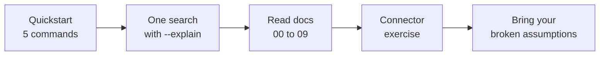

# 10. Your First Two Hours

This is the onboarding path. Follow it in order and you will touch every layer of the system once, see it explain itself, and finish with a design exercise that matters. Budget: about two hours, most of it reading output, not writing code.



## Hour one: run it and read one search

### The quickstart, command by command

**`podman compose up -d`** starts Postgres with the pgvector extension in a container. This is the knowledge base's only storage. It listens on port 5433 so it never collides with anything you already run. Docker works too.

**`pnpm install`** installs all four packages (core pipeline, CLI, MCP server, web UI) in one pass because this is one workspace.

**`cp .env.example .env`**, then optionally add a Cerebras key. With a key, ingestion distills documents with an LLM and `kb ask` writes cited answers. Without one, everything still runs in retrieval-only mode. The lesson is the degradation itself: the system asks for credentials, it never demands them.

**`pnpm kb init`** creates the tables and, if you added a key, makes one live API call to prove it works. Two green checkmarks. If this fails, your problem is environment, not architecture.

**`pnpm kb ingest`** runs the whole ingestion pipeline: connectors read the fixture sources, the LLM distills messy content into clean artifacts ([docs/03](03-distillation.md)), everything is embedded into one table ([docs/01](01-schema.md)). You get a summary table: ingested, skipped, degraded, failed, per source. Now run it a second time and watch every row get skipped. That is content-hash idempotency ([docs/02](02-ingestion.md)) demonstrating itself.

### One search, four blocks

```bash
pnpm kb search "restore hangs after manifest load" --project helios-eng --explain
```

Read the output top to bottom:

1. **Per-retriever lists** (`[fts]`, `[vector]`, `[rare]`, `[recency]`, plus one per project source). Five search strategies, five opinions. They disagree, and that disagreement is the argument for having five ([docs/04](04-retrieval.md)).
2. **The RRF fusion table.** Every candidate's score shown as actual arithmetic. A document three lists like beats a document one list loves. Consensus, by addition ([docs/05](05-fusion-rerank.md)).
3. **The rerank block.** A small LLM read the top candidates against your question and scored each 0 to 10. This is where "shares vocabulary but answers a different question" dies. It says `skipped` without a key, and results still work.
4. **Results.** The final ten, each traceable back up through the blocks above.

The habit that builds intuition: ask a question, predict which retriever wins, then check. Being wrong here is the fastest learning in the repo. The implementation behind every block is in [`packages/core/src/retrieval/`](../packages/core/src/retrieval/).

## Hour two: read, then design

Read [docs/00](00-overview.md) through [docs/09](09-write-your-own-connector.md) in order. They are short, and the reading order is the pipeline order. Two pages deserve extra attention: [docs/04](04-retrieval.md) for the measured surprises (in a technical corpus, "thanks" is statistically rarer than a config flag), and [docs/08](08-scaling.md) for the honesty table of every demo simplification next to its production replacement. Read 08 before proposing to build the real thing.

### The connector exercise

[docs/09](09-write-your-own-connector.md) is the tutorial. The steps:

1. **Pick a source you own.** A tool, an export, a database your team actually uses.
2. **Implement `discover()`**: yield raw items. Start from a JSON export; do not fight auth on day one.
3. **Implement `distill()`**: decide what the clean, searchable artifact of one item looks like, and which metadata matters (author, date, URL). The code is trivial. The judgment is the exercise.
4. **Wire it in**: one entry in the connector list, one line in the projects config.
5. **`pnpm kb ingest`** and watch your rows land in the same table as every other source.
6. **Search for something you know is in there**, with `--explain`, and see which retrievers find it.

The exercise is secretly a spec-writing session. Whoever does this for a real source has answered the exact questions a production knowledge base needs answered: what is a document, what is its artifact, who owns it, when does it expire.
