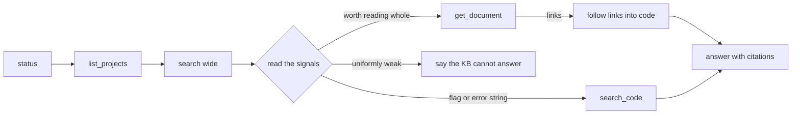

# 11. The agent playbook

Everything before this page explains how the KB works. This page is for the other side of the wire: an AI agent (Claude Code over MCP, a script shelling out to the CLI, any tool-calling loop) using the KB to actually solve a problem. The server's design bet, stated in [07-surfaces](07-surfaces.md), is that the client is the orchestrator: the eight tools serve evidence and nothing else, so investigation quality is decided by the pattern the agent runs, not by a pipeline hidden behind one tool. This is that pattern.

## The loop



1. **`status` first when anything looks empty.** A knowledge base with zero rows and a knowledge base with zero *relevant* rows return the same empty feeling through a search tool. `status` separates them: per-source counts, distilled fraction, newest document date. Never report "no evidence" without having ruled out "not ingested."
2. **`search` wide before narrow.** One hybrid query in project scope beats three premature source-scoped ones; fusion already runs five retrievers for you. Narrow to `search_confluence` or `search_jira` only after a wide result tells you which system holds the answer.
3. **Read the signals before the prose.** Each row carries machine-usable judgment; the next section decodes it.
4. **`get_document` instead of re-searching.** Following a citation by searching for its title is gambling on retrieval twice. Every result `url` dereferences deterministically: the whole thread, every section, the entire file.
5. **Follow `links` into code, `search_code` for the rest.** Distillation extracts the file paths a thread mentions and retrieval verifies them before surfacing; a link is a promise. Flags and function names are deliberately not links: they are `search_code` queries.
6. **Cite or abstain.** Every claim gets a url. When the signals are uniformly weak, the correct output is "the KB does not answer this," and the eval enforces exactly that behavior.

## A real investigation

The question: *why does checkpoint restore stall after manifest load?* One `search` call returns the runbook at rank 1 and, at rank 5, the incident that explains it. Real row, trimmed:

```json
{
  "title": "HEL-482: Checkpoint restore stalls after manifest load on 128-shard clusters",
  "url": "jira://HEL-482",
  "score": 0.0595, "scoreKind": "fused", "retrieverAgreement": 4,
  "authors": ["Maya Okafor", "Owen Reyes", "Sam Whitfield", "Priya Natarajan"],
  "links": ["github://helios/src/checkpoint/loader.ts"],
  "recency": "2026-05-03"
}
```

Four retrievers agreed on this row, four people touched the thread, and distillation left a verified pointer into the code. Two more calls finish the job, no second search needed: `get_document({ uri: "jira://HEL-482" })` returns the full thread including the resolution, and `get_document({ uri: "github://helios/src/checkpoint/loader.ts" })` lands on the file whose comment names `HELIOS_PREFETCH_DEPTH` and its SSD-assuming default. The agent now holds the incident, the fix decision, and the exact line of code, each with a citable url. This trajectory is not aspirational: `eval/golden.json`'s `hop-restore-stall` entry grades it end to end on every run.

## Reading the signals

| Field | Meaning | Act on it |
|---|---|---|
| `scoreKind: "fused"` | score is an RRF sum, roughly 0.01 to 0.1 | compare only against other fused scores |
| `scoreKind: "reranked"` | score is an LLM relevance grade, 0 to 10 | below ~4 means the reranker thinks it is noise |
| `retrieverAgreement` | how many of the five retrievers surfaced the row | 1 = one lens liked it; 3+ = trust it |
| `authors` | who wrote the underlying artifact | route follow-up questions with `who_knows` |
| `links` | verified hop targets from distillation | feed straight to `get_document` |
| `source: "meta"` | not evidence: a truncation notice or status row | adjust the query or the corpus, do not cite it |

Two token-spend rules fall out of the schema: pass `limit: 3` when the question is a lookup rather than a survey, and treat the `search_code` meta row ("matched N lines; showing the first…") as an instruction to narrow the regex, not as a result.

## What is deliberately not a tool

Three absences are design statements, not gaps. There is no `ask` tool and no planner tool over MCP: the moment the server synthesizes or decomposes, the agent is auditing someone else's reasoning instead of doing its own, and the server stops being LLM-free. And there is no write-back tool yet: letting agents store what they learned is the memory pattern worth teaching eventually, but it needs a review gate before it belongs in a corpus that other agents will cite as ground truth. See [08-scaling](08-scaling.md) for the full list of named simplifications.

## The eval is the contract

Every pattern above is enforced, not suggested: `expect` entries grade retrieval placement and print per-hit ranks with an MRR trend, `expectAbstain` entries verify the system can say nothing relevant exists, and `expectHop` entries replay the search-then-get trajectory to terminal evidence. An agent integration that breaks one of these behaviors fails `pnpm eval` before it confuses a user. If you extend the KB (a new connector via [09-write-your-own-connector](09-write-your-own-connector.md), a new retriever), add the golden question that would catch its regression first.
